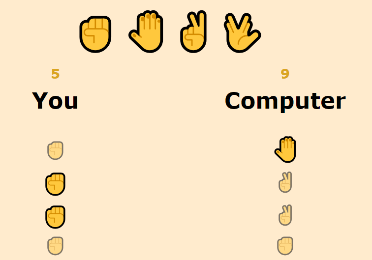

# Rock Paper Scissors Game 

This simple Rock-Paper-Scissor Browser Game I built using this [Youtube Tutorial](https://youtu.be/1yS-JV4fWqY). 

You can play my version [HERE](https://mariaremote.github.io/RockPaperScissorsGame/).

## Description

The user has a selection of hand emojis at the top to choose from. 

Once clicked, the computer's choice will be revealed and the game history will be displayed below highlighting the winning hand. 

Simultaneously there is a score for each player that keeps track of their victories. 

## My Spin on this

- An additional `Spock` hand that shows up randomly (25% chance) and can beat all other hands. The computer will play this hand also at the same probability. 

- A "fade-out" in the game history to only ever show the last `6` games played

## Issues

When trying to build the "fade-out" of the game history, my approach was to simply remove the last child items through their index.
However, since the game history is added in pairs, I need to remove two children at the same time also.

Currently I am exploring the following solutions: 

- set an additional class attribute for the "last-children" and then remove these collectively with `querySelectorAll('.last-children')`

- using the CSS grid container itself to limit the display of rows (overflow will simply be hidden)

